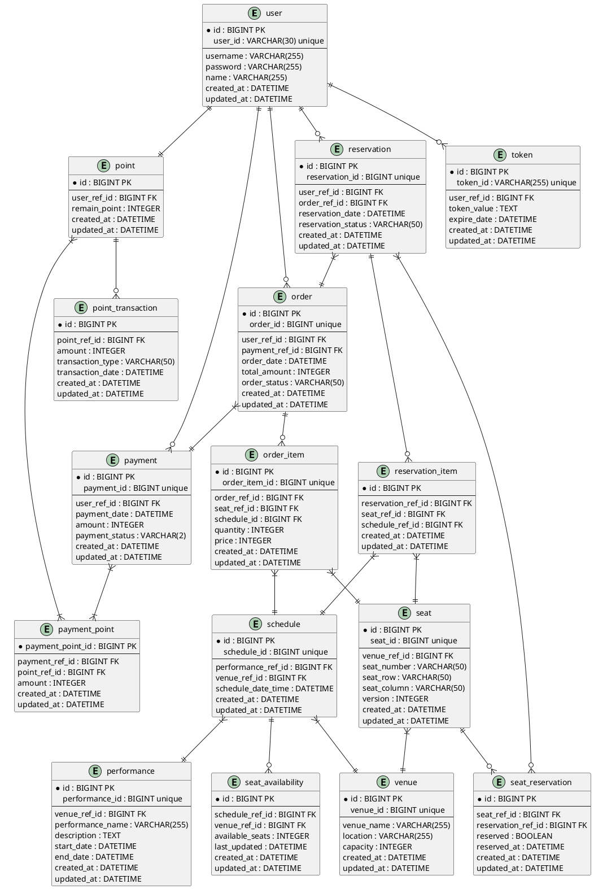

# 병목 쿼리 분석 및 최적화 솔루션 보고서

## 배경
이 시스템은 콘서트 티켓팅 플랫폼으로, User, Point, Token, Reservation, ReservationItem, Order, OrderItem, Payment, PaymentPoint, Seat, Venue, Performance, Schedule 등의 엔티티로 구성되어 있습니다.  
데이터베이스 스키마는 사용자 인증, 예약, 결제, 스케줄 관리를 위해 외래 키 관계로 설계되었습니다.  
아래 다섯 가지 주요 기능에서 발생할 수 있는 병목 쿼리를 분석하고, 이를 해결하기 위한 솔루션을 제시합니다.

> 유저 대기열 토큰 기능: 사용자 대기열 토큰 생성 및 검증.  
> 예약 가능 날짜/좌석 조회: 공연의 예약 가능한 스케줄과 좌석 조회.  
> 좌석 예약: 예약 생성 및 좌석 예약.  
> 잔액 충전 조회: 사용자 포인트 잔액 및 결제 내역 조회.  
> 결제 처리: 결제 처리 및 관련 엔티티 업데이트.  

이 보고서는 각 기능에서 예상되는 병목 쿼리를 식별하고, 테이블 재설계, 인덱스 추가, 캐싱, 비동기 처리 등의 솔루션을 제안합니다.

## 병목 쿼리 분석 및 솔루션
1. 유저 대기열 토큰 기능

설명: 사용자 대기열을 관리하기 위해 토큰을 생성하고 검증합니다.  
예상 병목 쿼리:  
삽입 쿼리:  
```
INSERT INTO Token (token_id, user_ref_id, token_value, expire_date, created_at, updated_at) VALUES (...)
```
문제: 피크 타임에 높은 쓰기 부하로 인한 지연.

조회 쿼리:
```
 SELECT * FROM Token WHERE token_id = ? AND expire_date > NOW()
 ```
문제: token_id는 고유 인덱스가 있지만, expire_date 조건으로 인해 추가 스캔 발생 가능.


검증 쿼리: 
```
SELECT * FROM Token WHERE user_ref_id = ? AND expire_date > NOW()
```
문제: user_ref_id에 단일 인덱스만 존재하여 비효율적인 조회.

문제 해결:
인덱스 추가: INDEX (user_ref_id, expire_date) 복합 인덱스를 추가하여 검증 쿼리 성능 개선.  
캐싱: Redis를 사용하여 토큰 데이터 캐싱(예정), 데이터베이스 조회 부하 감소.  
파티셔닝: Token 테이블을 created_at 기준으로 파티셔닝하여 오래된 토큰 아카이빙 및 쓰기 성능 개선.  
쿼리 최적화: expire_date 조건을 쿼리 최적화로 명시적 범위 스캔 사용.


2. 예약 가능 날짜/좌석 조회

설명: 사용자가 공연의 예약 가능한 날짜와 좌석을 조회합니다.  
예상 병목 쿼리:  
조회 쿼리:  

```
SELECT s.schedule_id, s.schedule_date_time, s.available_seats, se.seat_id, se.seat_number
FROM Schedule s
JOIN Performance p ON s.performance_ref_id = p.id
JOIN Seat se ON s.venue_ref_id = se.venue_ref_id
WHERE s.schedule_date_time >= NOW() AND se.reserved = FALSE;
```

문제: 다중 테이블 조인과 Seat 테이블의 대량 데이터 스캔으로 인한 지연.


필터링 쿼리: 
```
SELECT * FROM Seat WHERE venue_ref_id = ? AND reserved = FALSE
```

문제: reserved 조건에 대한 인덱스 부재로 풀 테이블 스캔 발생.

제안된 솔루션:
인덱스 추가: Seat 테이블에 INDEX (venue_ref_id, reserved) 복합 인덱스 추가로 필터링 속도 향상.  
뷰 생성: 자주 사용되는 조인 쿼리를 뷰로 정의하여 쿼리 복잡도 감소.  
캐싱: 인기 공연의 스케줄 및 좌석 가용성 데이터를 Redis에 캐싱하여 데이터베이스 부하 감소.  
테이블 재설계: Schedule 테이블의 available_seats를 별도의 SeatAvailability 테이블로 분리하여 조인 감소.  


3. 좌석 예약

설명: 사용자가 선택한 좌석을 예약하고 예약 상태를 업데이트합니다.  
예상 병목 쿼리:  
삽입 쿼리:  
```
INSERT INTO Reservation (reservation_id, user_ref_id, order_ref_id, reservation_date, reservation_status, created_at, updated_at) VALUES (...);
INSERT INTO ReservationItem (reservation_ref_id, seat_ref_id, schedule_ref_id, created_at, updated_at) VALUES (...);
```

문제: 동시 삽입 요청으로 인한 락 경쟁.


업데이트 쿼리:
```
UPDATE Seat SET reserved = TRUE WHERE seat_id = ?;
UPDATE Schedule SET available_seats = available_seats - 1 WHERE schedule_id = ?;
```
문제: 동시 업데이트로 인한 데드락 및 트랜잭션 지연.

제안된 솔루션:
낙관적 락: Seat 테이블에 version 컬럼 추가, 예약 시 버전 체크로 동시성 문제 해결.  
인덱스 추가: ReservationItem 테이블에 INDEX (seat_ref_id, schedule_ref_id) 복합 인덱스 추가로 조회 성능 향상.  
비동기 처리: Schedule.available_seats 업데이트를 비동기 작업으로 처리하여 트랜잭션 부하 감소.  
테이블 재설계: Seat 테이블의 reserved 상태를 SeatReservation 테이블로 분리하여 쓰기 충돌 최소화.  


4. 잔액 충전 조회

설명: 사용자의 포인트 잔액과 결제 내역을 조회합니다.  
예상 병목 쿼리:  
잔액 조회 쿼리:  
```
 SELECT remain_point FROM Point WHERE user_ref_id = ?
```
문제: 빈번한 조회로 인한 읽기 부하.


결제 내역 쿼리:
```
SELECT p.payment_id, p.payment_date, p.amount
FROM Payment p
JOIN PaymentPoint pp ON p.id = pp.payment_ref_id
WHERE p.user_ref_id = ? ORDER BY p.payment_date DESC;
```

문제: Payment 테이블의 대량 데이터와 조인으로 인한 느린 응답.

제안된 솔루션:
인덱스 추가: Payment 테이블에 INDEX (user_ref_id, payment_date) 복합 인덱스 추가로 조회 속도 향상.  
캐싱: Point.remain_point 값을 Redis에 캐싱하여 빈번한 조회 부하 감소.  
파티셔닝: Payment 테이블을 payment_date 기준으로 파티셔닝하여 오래된 데이터 분리 및 조회 성능 개선.  
쿼리 최적화: LIMIT과 OFFSET을 활용하여 결제 내역 페이징 처리.  


5. 결제 처리

설명: 결제를 처리하고 관련 테이블을 업데이트합니다.  
예상 병목 쿼리:  
삽입 쿼리:  
```
INSERT INTO Order (order_id, user_ref_id, payment_ref_id, order_date, total_amount, order_status, created_at, updated_at) VALUES (...);

INSERT INTO Payment (payment_id, user_ref_id, payment_date, amount, payment_status, created_at, updated_at) VALUES (...);

INSERT INTO PaymentPoint (payment_ref_id, point_ref_id, amount) VALUES (...);
```

문제: 다중 테이블 삽입으로 인한 트랜잭션 지연.


업데이트 쿼리:
```
 UPDATE Point SET remain_point = remain_point + ? WHERE user_ref_id = ?
```
문제: 동시 업데이트로 인한 락 경쟁.

제안된 솔루션:
인덱스 추가: PaymentPoint 테이블에 INDEX (payment_ref_id, point_ref_id) 복합 인덱스 추가로 삽입 성능 향상.   
비동기 처리: Point 테이블 업데이트를 비동기 작업으로 처리하여 트랜잭션 시간 단축.  
테이블 재설계: Point 테이블에 PointTransaction 테이블 추가로 잔액 변경 로그 관리, 업데이트 충돌 최소화.  
쿼리 최적화: 트랜잭션 내 쿼리 순서 최적화로 락 시간 최소화.  

## 결정

### 인덱스 최적화:  
> Token: INDEX (user_ref_id, expire_date).  
> Seat: INDEX (venue_ref_id, reserved).  
> ReservationItem: INDEX (seat_ref_id, schedule_ref_id).  
> Payment: INDEX (user_ref_id, payment_date).  
> PaymentPoint: INDEX (payment_ref_id, point_ref_id).  


### 캐싱 도입:
Redis를 사용하여 Token, Point.remain_point, 인기 공연의 Schedule 및 Seat 데이터 캐싱.  
추후 작업 예정.  


### 테이블 재설계 진행:
**SeatAvailability 테이블로 Schedule.available_seats 관리.**  
**SeatReservation 테이블로 Seat.reserved 충돌 최소화.**  
**PointTransaction 테이블로 포인트 트랜잭션 관리.**  


### 비동기 처리:
Schedule.available_seats 및 Point 업데이트를 비동기 작업으로 전환.  


### 파티셔닝:
Token 및 Payment 테이블을 created_at 또는 payment_date 기준으로 파티셔닝.  


## 결과

> 예상 효과: 쿼리 응답 시간 단축, 동시성 문제 완화, 데이터베이스 부하 감소.  
>> 후속 작업:
>> 인덱스 및 캐싱 구현 후 성능 테스트.  
>> 비동기 처리 워크플로우 설계 및 배포.  
>> 테이블 재설계 적용 후 데이터 마이그레이션 계획 수립.  

## 변경된 ERD



