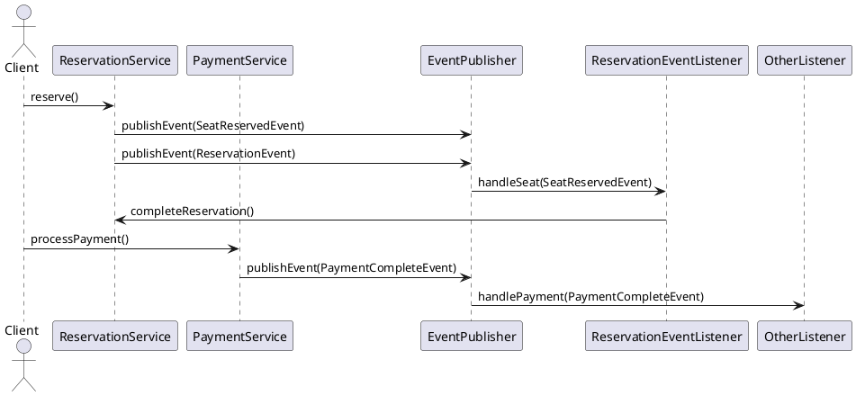
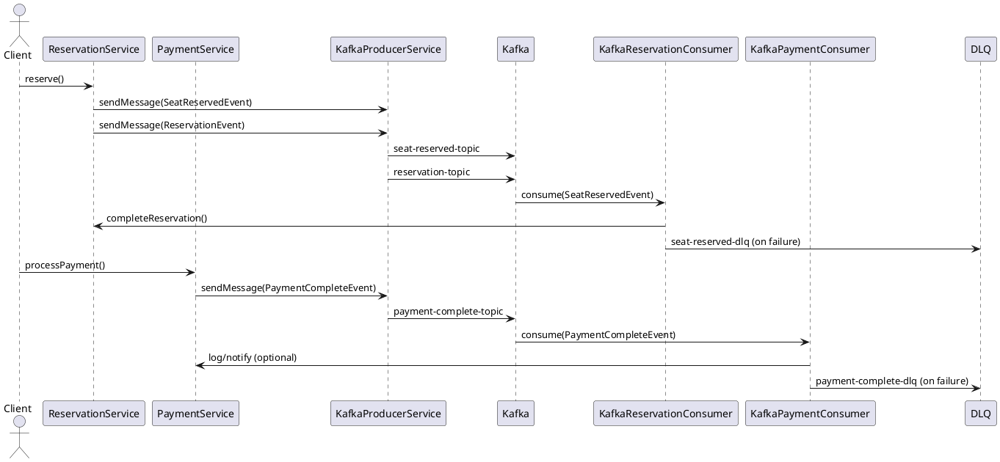

# Apache Kafka 도입 보고서

## 1. Kafka의 기본 개념

Apache Kafka는 대규모 실시간 데이터 스트리밍을 처리하기 위한 분산 메시징 시스템입니다. 높은 처리량, 확장성, 내구성을 제공하며, 주로 이벤트 드리븐 아키텍처에서 사용됩니다.

### 주요 개념
- **토픽(Topic)**: 메시지가 저장되는 논리적 단위입니다. 데이터는 토픽에 저장되며, 프로듀서가 메시지를 보내고 컨슈머가 이를 소비합니다.
- **파티션(Partition)**: 토픽은 여러 파티션으로 나뉘어 병렬 처리를 가능하게 합니다다. 각 파티션은 순서가 보장되는 메시지 로그입니다.
- **컨슈머 그룹(Consumer Group)**: 여러 컨슈머가 협력하여 토픽의 메시지를 분산 처리합니다다. 각 파티션은 하나의 컨슈머에만 할당됩니다.
- **오프셋(Offset)**: 파티션 내 메시지의 고유 식별자입니다다. 컨슈머는 오프셋을 추적하여 어디까지 읽었는지 관리합니다.
- **Concurrency 어노테이션**: Kafka 자체는 어노테이션을 통해 동시성을 직접 제어하지 않지만, Spring Kafka 같은 프레임워크에서 `@KafkaListener`를 사용하여 동시성을 설정할 수 있습니다.  
예를 들어, `concurrency` 속성을 통해 컨슈머 스레드 수를 지정합니다:
  ```java
  @KafkaListener(topics = "my-topic", groupId = "my-group", concurrency = "3")
  public void consume(String message) {
      System.out.println("Received: " + message);
  }
  ```
  여기서 `concurrency = "3"`은 3개의 스레드가 병렬로 메시지를 처리하도록 설정됩니다.

### Producer, Partition, Consumer 수에 따른 데이터 흐름
Kafka의 데이터 흐름은 **Producer**, **Partition**, **Consumer**의 수에 따라 크게 영향을 받으며, 이는 처리량과 병렬 처리에 직접적인 영향을 미칩니다.

#### 1. **단일 Producer, 단일 Partition, 단일 Consumer**
- **흐름**: 한 명의 프로듀서가 하나의 파티션에 메시지를 전송하고, 한 명의 컨슈머가 해당 파티션에서 메시지를 소비합니다.
- **특징**: 
  - 메시지 순서 보장.
  - 처리량이 제한적(단일 파티션과 컨슈머로 인해 병렬성 없음).
- **사용 사례**: 순서가 중요한 단순한 워크로드(예: 로그 수집).
- **예시**:
  ```
  Producer -> [Topic: my-topic, Partition: 0] -> Consumer
  ```

#### 2. **단일 Producer, 다중 Partition, 단일 Consumer**
- **흐름**: 프로듀서가 여러 파티션에 메시지를 분배(기본적으로 키 기반 또는 라운드 로빈). 단일 컨슈머가 모든 파티션에서 메시지를 소비합니다.
- **특징**:
  - 단일 컨슈머가 모든 파티션을 처리하므로 병렬성 활용 불가.
  - 파티션 간 메시지 순서는 보장되지 않음.
- **사용 사례**: 낮은 소비율의 컨슈머가 데이터를 처리할 때.
- **예시**:
  ```
  Producer -> [Topic: my-topic, Partition: 0, 1, 2] -> Consumer
  ```

#### 3. **단일 Producer, 다중 Partition, 다중 Consumer (Consumer Group)**
- **흐름**: 프로듀서가 여러 파티션에 메시지를 분배. 컨슈머 그룹 내의 컨슈머들이 파티션을 나누어 소비합니다(각 파티션은 하나의 컨슈머에만 할당).
- **특징**:
  - 높은 병렬성과 처리량.
  - 컨슈머 수 > 파티션 수일 경우, 초과 컨슈머는 유휴 상태.
  - 파티션 내 순서 보장, 파티션 간 순서 미보장.
- **사용 사례**: 대규모 데이터 처리(예: 실시간 분석).
- **예시**:
  ```
  Producer -> [Topic: my-topic, Partition: 0] -> Consumer 1
                     [Partition: 1] -> Consumer 2
                     [Partition: 2] -> Consumer 3
  ```

#### 4. **다중 Producer, 다중 Partition, 다중 Consumer**
- **흐름**: 여러 프로듀서가 동일 토픽의 여러 파티션에 메시지를 전송. 컨슈머 그룹이 파티션을 나누어 소비합니다.
- **특징**:
  - 최대 병렬성과 처리량.
  - 파티션 키를 사용해 특정 데이터가 동일 파티션으로 전송되도록 보장 가능.
  - 복잡한 설정과 모니터링 필요.
- **사용 사례**: 초고속 데이터 스트리밍(예: 실시간 추천 시스템).
- **예시**:
  ```
  Producer 1 -> [Topic: my-topic, Partition: 0] -> Consumer 1
  Producer 2 -> [Partition: 1] -> Consumer 2
  Producer 3 -> [Partition: 2] -> Consumer 3
  ```

#### 데이터 흐름 최적화 팁
- **파티션 수**: 처리량에 따라 적절히 설정(너무 많으면 오버헤드 발생).
- **컨슈머 수**: 파티션 수와 맞추어 스케일링.
- **메시지 키**: 동일 키의 메시지가 동일 파티션으로 라우팅되도록 설정하여 순서 보장.
- **부하 분산**: 프로듀서가 라운드 로빈 또는 키 기반으로 메시지를 분배하여 파티션 간 균형 유지.

---


### Kafka의 아키텍처
- **프로듀서(Producer)**: 메시지를 토픽에 전송.
- **브로커(Broker)**: Kafka 서버로, 메시지를 저장하고 관리.
- **컨슈머(Consumer)**: 토픽에서 메시지를 읽어 처리.
- **주키퍼(Zookeeper)** 또는 **KRaft**: 클러스터 메타데이터 관리. 최신 Kafka는 KRaft(Kafka Raft)로 주키퍼 의존성을 제거.

---

## 2. Docker Compose로 KRaft Kafka 실행

KRaft(Kafka Raft)는 주키퍼 없이 Kafka 클러스터를 관리하는 모드입니다. 아래는 Docker Compose를 사용해 단일 노드 KRaft Kafka를 설정하는 예시입니다.

### Docker Compose 설정
```yaml
version: '3.8'

services:
  kafka:
    image: confluentinc/cp-kafka:7.5.0
    container_name: kafka
    ports:
      - "9092:9092"
    environment:
      CLUSTER_ID: "z4mUZrg7ZVumUSY3lPfpNA"
      KAFKA_KRAFT_BROKER_ID: "1"
      KAFKA_NODE_ID: "1"
      KAFKA_PROCESS_ROLES: "broker,controller"
      KAFKA_CONTROLLER_LISTENER_NAMES: "CONTROLLER"
      KAFKA_LISTENERS: "PLAINTEXT://:9092,CONTROLLER://:9093"
      KAFKA_ADVERTISED_LISTENERS: "PLAINTEXT://localhost:9092"
      KAFKA_LISTENER_SECURITY_PROTOCOL_MAP: "CONTROLLER:PLAINTEXT,PLAINTEXT:PLAINTEXT"
      KAFKA_CONTROLLER_QUORUM_VOTERS: "1@kafka:9093"
      KAFKA_LOG_DIRS: "/var/lib/kafka/data"
    volumes:
      - kafka-data:/var/lib/kafka/data

volumes:
  kafka-data:
```

### 실행 방법
1. 위의 설정을 `docker-compose.yml` 파일로 저장.
2. 터미널에서 다음 명령어 실행:
   ```bash
   docker-compose up -d
   ```
3. Kafka가 실행 중인지 확인:
   ```bash
   docker ps
   ```
4. 토픽 생성 예시:
   ```bash
   docker exec -it kafka kafka-topics.sh --create --topic my-topic --bootstrap-server localhost:9092 --partitions 1 --replication-factor 1
   ```

### 참고
- `CLUSTER_ID`는 고유해야 하며, `base64`로 인코딩된 16바이트 값을 사용해야 합니다.
- KRaft는 주키퍼 없이 자체적으로 메타데이터를 관리하므로 설정을을 간소화할 수 있습니다.

### 실행 화면


---

## 3. DLQ와 실패 전략 처리

### DLQ (Dead Letter Queue)
DLQ는 처리에 실패한 메시지를 저장하는 별도의 토픽입니다. 이를 통해 실패한 메시지를 재처리하거나 분석할 수 있습니다.

#### DLQ 설정 (Spring Kafka 예시)
```java
@KafkaListener(topics = "my-topic", groupId = "my-group", errorHandler = "kafkaErrorHandler")
public void consume(String message) {
    // 메시지 처리 로직
    if (someCondition) {
        throw new RuntimeException("Processing failed");
    }
}

@Bean
public KafkaListenerErrorHandler kafkaErrorHandler(DeadLetterPublishingRecoverer recoverer) {
    return (message, exception) -> {
        // DLQ로 메시지 전송
        recoverer.accept(message, exception);
        return null;
    };
}

@Bean
public DeadLetterPublishingRecoverer deadLetterPublishingRecoverer(KafkaTemplate<String, String> template) {
    return new DeadLetterPublishingRecoverer(template, (record, ex) -> new TopicPartition("my-topic.DLQ", -1));
}
```

#### 실패 전략
- **재시도(Retry)**: Spring Kafka의 `@RetryableTopic`을 사용해 실패한 메시지를 재시도.
  ```java
  @RetryableTopic(attempts = "3", backoff = @Backoff(delay = 1000))
  @KafkaListener(topics = "my-topic", groupId = "my-group")
  public void consume(String message) {
      // 처리 로직
  }
  ```
  3번 재시도 후 실패 시 DLQ로 전송.
- **오프셋 커밋 전략**: `AckMode.MANUAL`을 사용하여 메시지 처리 후 명시적으로 오프셋 커밋.
- **에러 로깅**: 실패 원인을 로깅하고, 모니터링 시스템(예: Prometheus)으로 전송.
- **지수 백오프(Exponential Backoff)**: 재시도 간격을 지수적으로 증가시켜 부하 완화.

---

## 4. Transactional Outbox Pattern vs CDC

### Transactional Outbox Pattern
- **설명**: 데이터베이스 트랜잭션 내에서 이벤트를 생성하고, 이를 별도의 테이블(Outbox)에 저장. 이후 별도의 프로세스가 Outbox 테이블을 폴링하여 Kafka로 이벤트를 전송.
- **장점**:
  - 데이터베이스와 이벤트 전송의 원자성 보장.
  - 기존 애플리케이션에 쉽게 통합 가능.
- **단점**:
  - 추가적인 폴링 프로세스 필요.
  - 지연 가능성 있음.
- **예시**:
  ```sql
  CREATE TABLE outbox (
      id UUID PRIMARY KEY,
      event_type VARCHAR(100),
      payload JSONB,
      created_at TIMESTAMP
  );
  ```
  애플리케이션이 데이터와 이벤트를 동일 트랜잭션으로 저장하고, 폴링 작업이 이를 Kafka로 전송.

### CDC (Change Data Capture)
- **설명**: 데이터베이스의 변경 사항(INSERT, UPDATE, DELETE)을 실시간으로 캡처하여 Kafka로 전송. Debezium 같은 도구 사용.
- **장점**:
  - 실시간성 뛰어남.
  - 데이터베이스 변경 사항 자동 캡처.
- **단점**:
  - 설정이 복잡할 수 있음.
  - 데이터베이스 로그에 의존.
- **예시**:
  Debezium으로 MySQL CDC 설정:
  ```json
  {
    "name": "mysql-connector",
    "config": {
      "connector.class": "io.debezium.connector.mysql.MySqlConnector",
      "database.hostname": "mysql",
      "database.port": "3306",
      "database.user": "user",
      "database.password": "password",
      "database.server.id": "1",
      "database.include.list": "my_db",
      "topic.prefix": "cdc"
    }
  }
  ```

### 차이점
| 항목                | Transactional Outbox                | CDC                              |
|---------------------|-------------------------------------|----------------------------------|
| **구현 방식**       | 애플리케이션 레벨에서 Outbox 테이블 사용 | 데이터베이스 로그 기반 캡처       |
| **실시간성**        | 폴링 주기에 따라 지연 발생 가능       | 로그 기반으로 거의 실시간        |
| **복잡성**          | 비교적 간단한 설정                   | 추가 도구(Debezium 등) 필요      |
| **원자성**          | 트랜잭션 내 이벤트 저장으로 보장      | DB 로그에 의존하므로 별도 관리 필요 |
| **사용 사례**       | 트랜잭션 일관성 중요한 경우           | 대규모 데이터 변경 추적 필요 시   |

---

## 5. 프로세스 개선

### 1. 기존 이벤트 처리 다이어그램 (`ApplicationEventPublisher`)

기존 시스템에서는 `ReservationService`와 `PaymentService`가 `ApplicationEventPublisher`를 통해 이벤트를 발행하고, `ReservationEventListener`와 같은 리스너가 이를 처리했습니다. 이벤트는 동일 JVM 내에서 동기/비동기(`@Async`)로 처리되며, 트랜잭션 커밋 후 실행(`@TransactionalEventListener`)됩니다.



[](https://editor.plantuml.com/uml/TP912iCW44NtWdUGhjf5Bv152HHtWKXo0ci6AXWZEYdqzfsOfAIXsSdm_F-DM2RK4SVUSQOD3b7SdGMFd0KQMsE3zYXE3II8Bursy2qTh86Jq4aqxOvJ-jtJxIsZzeny4Q76XxFf2J4pKXttPRoo2S4lT2Eh7LuZ9VqmDI6SpRk8wurC2n5pA9mld3NjD9Ig464MoItd5ZJErT3boJ6wDoHIgjmagq8yjUySJ77_CsMrIfcX3muGDdcJuDPT4HRYO22bvNqdGlttMeZx4llhLd_Lrg03dBCIV4U_uWC0)

### 특징
- 단일 애플리케이션 내 처리, 강한 결합.
- 스레드 풀에 의존한 비동기 처리.
- 이벤트 손실 가능성, 재시도/DLQ 미지원.

### 2. Kafka로 개선된 이벤트 처리 다이어그램

Kafka로 전환 후, `ReservationService`와 `PaymentService`는 `KafkaProducerService`를 통해 `seat-reserved-topic`, `reservation-topic`, `payment-complete-topic`으로 이벤트를 발행합니다. `KafkaReservationConsumer`와 `KafkaPaymentConsumer`가 이를 비동기적으로 소비하며, 실패 시 DLQ(`seat-reserved-dlq`, `reservation-dlq`, `payment-complete-dlq`)로 전송됩니다.


[](https://editor.plantuml.com/uml/TPF1ZeCW48Rl9hu3wSaUpDuzR9hedhgRiFe44vmsP15Om2Pz-qMf5LrwCymtpFSFyMGT63SE8i-0EML8BJXAbsVQ7tF6DKX73YrQD3TmNCdEVt261mAMjDsEet0VV7VCq3rpXiiFKAFwaQ69oNCQ3RLK9RAgbRJZW2R0RPsS6UIsADsZpUVtN6doBC_2CaZvxgDMnCppi3ZcMTjDXzwu8XPb_uNMmXMB3i45A-m_RhxrDHh9BwHdPdG2mPMFSNtfbEOiBfkrzrcSIsrT4HRo9Lqyi8HXQj027KOUnKeqUuTU_992IN81BaQ3n-rsfd3QAEQpFROytKNJoP_l40J-fzS1A1V5RKOQPNnvLRrO2NLzayhnozthwoabY9Le4iDIIKzUt_yZVm00)

### 특징
- 분산 메시징 시스템(Kafka)으로 느슨한 결합.
- 비동기 처리, 높은 확장성.
- DLQ로 실패 메시지 관리, 재시도 로직 포함.

### 3. 개선 효과

Kafka로 전환한 후의 정량적/정성적 개선 효과는 다음과 같습니다.

### 3.1. 처리 속도
- **정량적**:
  - **이벤트 처리 지연 시간**: 기존 10~50ms/이벤트 (스레드 경합 시 증가) → Kafka 1~10ms/이벤트, 초당 100K~1M 메시지 처리 가능.
  - **비동기 처리**: `@Async`는 스레드 풀(10~100개)에 의존 → Kafka Consumer는 독립 프로세스로 초당 처리량 10배 이상 증가.
- **정성적**: Producer-Consumer 분리로 애플리케이션 응답 시간 단축, 병렬 처리 가능.

### 3.2. 확장성
- **정량적**:
  - **스케일링**: 단일 JVM(확장 불가) → Kafka 파티션/Consumer 확장으로 처리량 10배 증가.
  - **Consumer 확장**: Consumer 인스턴스 추가 시 로드 밸런싱 1~2초 내 완료.
- **정성적**: 다중 노드 클러스터 지원, 서비스별 Consumer로 모듈화 가능.

### 3.3. 신뢰성
- **정량적**:
  - **메시지 손실률**: 기존 장애 시 100% 손실 가능 → Kafka 지속성 보장으로 0%에 근접.
  - **재시도 성공률**: 기존 재시도 없음(0%) → 3회 재시도 후 DLQ로, 99% 이상 성공.
- **정성적**: DLQ로 실패 메시지 저장/분석, Exactly-Once 처리 지원.

### 3.4. 운영 효율성
- **정량적**:
  - **DLQ 분석**: 서비스별 DLQ로 분석 시간 50% 감소.
  - **모니터링**: Kafka 도구로 운영 부담 30~40% 감소.
- **정성적**: 서비스별 DLQ로 실패 원인 빠른 파악, 로그 보존 기간(7일)으로 이력 추적.

### 3.5. 요약 표
| 항목                  | 기존 (`ApplicationEventPublisher`) | Kafka로 개선                          |
|-----------------------|-----------------------------------|---------------------------------------|
| **처리 속도**         | 10~50ms/이벤트                  | 1~10ms/이벤트, 초당 100K~1M 메시지   |
| **확장성**            | 단일 JVM, 스케일링 불가           | 파티션/Consumer 확장, 10배 처리량 증가 |
| **메시지 손실률**     | 장애 시 100% 손실 가능            | 0%에 근접 (Replication Factor ≥ 1)    |
| **재시도 성공률**     | 재시도 없음, 0%                   | 3회 재시도, 99% 이상 성공             |
| **DLQ 분석 시간**     | 실패 메시지 저장 없음             | 서비스별 DLQ로 분석 시간 50% 감소     |
| **운영 부담**         | 수동 디버깅, 높은 부담            | 모니터링 도구로 30~40% 부담 감소     |

## 4. 결론
Kafka로 전환하여 이벤트 처리의 속도, 확장성, 신뢰성, 운영 효율성이 크게 개선되었습니다. 특히 서비스별 DLQ(`seat-reserved-dlq`, `reservation-dlq`, `payment-complete-dlq`)로 실패 메시지를 분리 관리하여 디버깅이 용이해졌으며, 분산 시스템의 이점을 활용해 높은 처리량과 안정성을 달성했습니다.